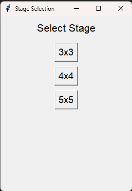
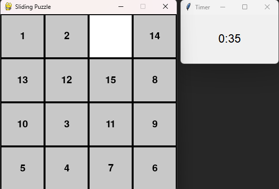
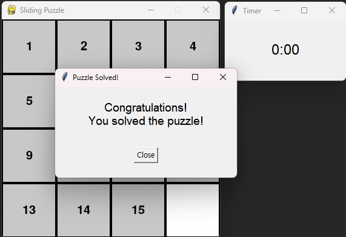

# Sliding Puzzle Game

A Python-based sliding puzzle game with stage selection, smooth animations, and a separate timer display.

## Features

1. **Stage Selection**
   - Choose from 3x3, 4x4, and 5x5 grid sizes.
   - Implemented using a `tkinter` window for user-friendly interaction.

2. **Timer**
   - A separate `tkinter` window displays the elapsed time.
   - Automatically starts when the puzzle begins and stops when solved.

3. **Smooth Animations**
   - Sliding tiles have smooth animations for better user experience.

4. **Puzzle Validation**
   - Checks if the puzzle is solvable before displaying it.
   - Determines when the puzzle is solved and displays a success message.

---

## Installation

1. Clone this repository:
   ```bash
   git clone https://github.com/greninja09/Sliding_Puzzle.git
   cd sliding-puzzle
   ```
2. Ensure you have Python 3.9+ installed.
3. Install the required dependencies:
   ```bash
   pip install -r requirements.txt
   ```

---

## Usage

1. Navigate to the `src` folder:
   ```bash
   cd src
   ```
2. Run the game:
   ```bash
   python main.py
   ```
3. Select a puzzle size (3x3, 4x4, or 5x5) in the stage selection menu.
4. Solve the puzzle by rearranging the tiles in ascending order, with the blank space at the bottom-right corner.
5. View the timer progress in the separate `tkinter` window.

---

## Controls

- **Mouse click:** Click on a tile adjacent to the blank space to move it.
- **Exit:** Close the window to stop the game.

---

## File Structure
```
sliding-puzzle/
│
├── src/                   # Source code folder
│   ├── main.py            # Entry point of the game
│   ├── game.py            # Core game loop and win condition
│   ├── stages.py          # Stage selection interface
│   ├── grid.py            # Puzzle grid logic
│   ├── config.py          # Configuration settings (e.g., screen size, colors)
│   ├── ui.py              # Drawing functions and animations
│   └── timer.py           # Timer functionality using tkinter
│
├── assets/                # Images
│
├── README.md              # Project description
├── .gitignore             # Excluded files
├── LICENSE                # License information
└── requirements.txt       # Python package dependencies
```

---

## Demo

### 1. Stage Selection


### 2. Puzzle Gameplay


### 3. Solved the Game


---

## License

This project is licensed under the MIT License. See the [LICENSE](LICENSE) file for details.

---

## Acknowledgments

- Pygame: For game graphics and animation.
- Tkinter: For the timer and stage selection interface.
- Special thanks to ChatGPT.


---

Korean Description / 한국어 설명
---
# 슬라이딩 퍼즐 게임

스테이지 선택, 부드러운 애니메이션, 별도의 타이머 표시 기능을 갖춘 Python 기반의 슬라이딩 퍼즐 게임입니다.

## 기능

1. **스테이지 선택**
   - 3x3, 4x4, 5x5 그리드 크기 중 선택 가능합니다.
   - 사용자 친화적인 인터페이스를 제공하는 `tkinter` 윈도우로 구현되었습니다.

2. **타이머**
   - 별도의 `tkinter` 윈도우에서 경과 시간을 표시합니다.
   - 퍼즐 시작 시 자동으로 시작되고, 퍼즐이 해결되면 자동으로 멈춥니다.

3. **부드러운 애니메이션**
   - 슬라이딩 타일에 부드러운 애니메이션을 적용해 더 나은 사용자 경험을 제공합니다.

4. **퍼즐 유효성 검사**
   - 퍼즐이 표시되기 전에 풀이 가능한 상태인지 확인합니다.
   - 퍼즐이 해결되었을 때 이를 감지하고 성공 메시지를 표시합니다.

---

## 설치 방법

1. 이 저장소를 clone합니다:
   ```bash
   git clone https://github.com/greninja09/Sliding_Puzzle.git
   cd sliding-puzzle
   ```
2. Python 3.9 이상의 버전을 설치했는지 확인합니다.
3. 필요한 패키지를 설치합니다:
   ```bash
   pip install -r requirements.txt
   ```

---

## 사용 방법

1. `src` 폴더로 이동합니다:
   ```bash
   cd src
   ```
2. 게임을 실행합니다:
   ```bash
   python main.py
   ```
3. 스테이지 선택 메뉴에서 퍼즐 크기(3x3, 4x4, 5x5)를 선택합니다.
4. 타일을 재배열하여 빈 칸을 우하단에 두고 오름차순으로 정렬하면 퍼즐을 해결할 수 있습니다.
5. 별도의 `tkinter` 윈도우에서 타이머를 확인할 수 있습니다.

---

## 컨트롤

- **마우스 클릭:** 빈 공간과 인접한 타일을 클릭하면 이동합니다.
- **종료:** 창을 닫으면 게임이 종료됩니다.

---

## 파일 구조
```
sliding-puzzle/
│
├── src/                   # 소스 코드 폴더
│   ├── main.py            # 게임의 진입점
│   ├── game.py            # 게임 루프 및 승리 조건 처리
│   ├── stages.py          # 스테이지 선택 인터페이스
│   ├── grid.py            # 퍼즐 그리드 로직
│   ├── config.py          # 화면 크기, 색상 등 설정
│   ├── ui.py              # 그리기 및 애니메이션 함수
│   └── timer.py           # tkinter 기반 타이머 기능
│
├── assets/                # 이미지
│
├── README.md              # 프로젝트 설명
├── .gitignore             # 제외할 파일 목록
├── LICENSE                # 라이선스 정보
└── requirements.txt       # 필요한 Python 패키지
```

---

## 데모

### 1. 스테이지 선택


### 2. 퍼즐 풀기


### 3. 퍼즐을 완성했을 때


---

## 라이선스

이 프로젝트는 MIT 라이선스에 따라 제공됩니다. 자세한 내용은 [LICENSE](LICENSE) 파일을 참조하세요.

---

## 감사의 말

- Pygame: 게임 그래픽 및 애니메이션용.
- Tkinter: 타이머 및 스테이지 선택 인터페이스 구현용.
- ChatGPT에게 특별히 감사드립니다.
